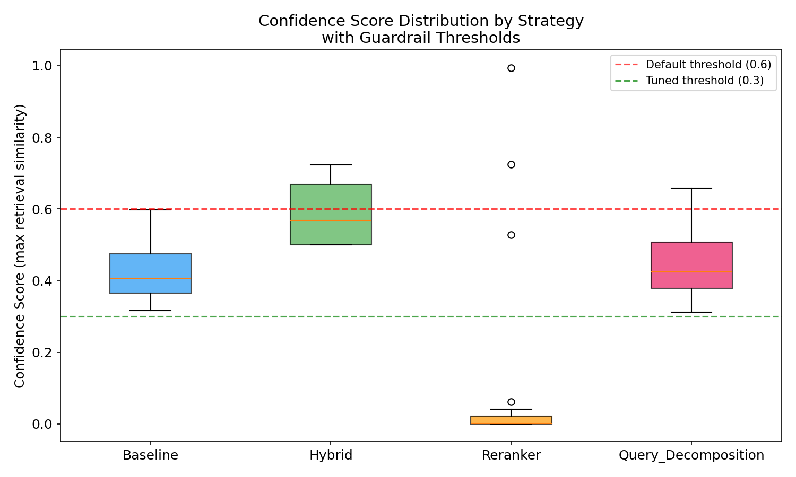
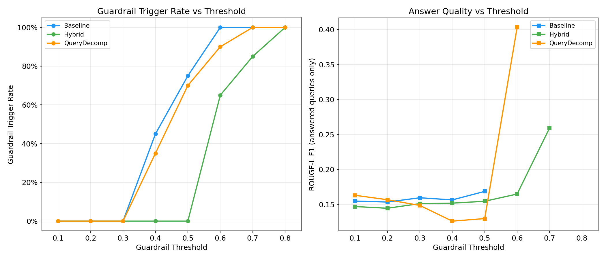

# RAG-Bench: Comparative Evaluation of RAG Retrieval Strategies with Hallucination Guardrails

[](https://www.python.org/downloads/)
[](LICENSE)
[](https://fastapi.tiangolo.com/)
[](https://streamlit.io/)

An empirical comparison of 4 RAG (Retrieval-Augmented Generation) retrieval strategies on MS MARCO, measuring the tradeoff between retrieval quality, answer faithfulness, latency, cost, and guardrail behavior. Includes 3 additional experimental strategies (HyDE, Self-RAG, Multi-Query Fusion) implemented but not yet benchmarked.

**Research question**: _How do retrieval strategy choices (sparse, dense, hybrid, reranking, query decomposition) affect downstream answer quality and hallucination rates in a RAG pipeline, and can retrieval-score-based guardrails reliably prevent low-confidence answers?_

> **Scope**: Course project for CS 599. This is a research/evaluation tool, not a production system. It implements production patterns (rate limiting, auth, Docker) for demonstration purposes.

---

## Table of Contents

- [Key Results](#key-results)
- [Research Motivation](#research-motivation)
- [Architecture](#architecture)
- [Retrieval Strategies](#retrieval-strategies)
- [Hallucination Guardrails](#hallucination-guardrails)
- [Evaluation Methodology](#evaluation-methodology)
- [Experiments](#experiments)
- [Quick Start](#quick-start)
- [Usage](#usage)
- [Custom Data Upload](#custom-data-upload)
- [REST API](#rest-api)
- [Configuration Reference](#configuration-reference)
- [Testing](#testing)
- [Deployment](#deployment)
- [Limitations and Future Work](#limitations-and-future-work)
- [References](#references)
- [License](#license)

---

## Key Results

### With tuned guardrail threshold (0.3)

Benchmark on MS MARCO dev split (20 queries, 10,000 passages, `seed=42`, threshold=0.3):

| Strategy | Confidence | Trigger Rate | ROUGE-L F1 | Faithfulness | Latency (ms) |
|---|---|---|---|---|---|
| Baseline (Semantic) | 0.426 | 0% | 0.154 | 0.292 | 679 |
| Hybrid (BM25+Semantic) | **0.586** | 0% | 0.159 | 0.281 | 622 |
| Reranker (Cohere) | 0.120* | 85% | **0.216** | **0.583** | 3,564 |
| Query Decomposition | 0.455 | 0% | 0.156 | 0.303 | 2,262 |

_*Reranker confidence artificially low due to Cohere Trial key rate-limit fallbacks. See [Limitations](#limitations-and-future-work)._

### With default threshold (0.6) - Calibration discovery

| Strategy | Trigger Rate | ROUGE-L F1 | Faithfulness |
|---|---|---|---|
| Baseline | **100%** (all refused) | N/A | N/A |
| Hybrid | 65% | 0.152 | 0.296 |
| Reranker | 90% | 0.205 | 0.550 |
| Query Decomp | 85% | 0.226 | 0.486 |

> **To reproduce**: `python main.py benchmark` (full 500 queries) or `python main.py benchmark --limit 20` (quick). Results in `./results/`.

### Key Findings

1. **Guardrail threshold must be calibrated per dataset.** The default 0.6 threshold causes 100% refusal on Baseline because ChromaDB cosine similarities for MS MARCO cluster in 0.3-0.6. Lowering to 0.3 allows all strategies to produce answers. See threshold sweep experiment below.

2. **Hybrid retrieval achieves the highest confidence scores** (0.586 vs 0.426 Baseline). BM25 rescues keyword-specific queries that dense embeddings miss, with negligible latency overhead (622ms vs 679ms).

3. **Reranker achieves the highest faithfulness** (0.583) when it successfully reranks, but Cohere Trial key limits (10 calls/min) cause 85% fallback rate during benchmarking.

4. **Query Decomposition adds latency (3.3x) without proportional quality gains** on MS MARCO's simple factoid queries (ROUGE-L 0.156 vs Baseline 0.154). Would likely show greater benefit on multi-hop reasoning tasks.

5. **Retrieval confidence alone cannot prevent hallucination.** Failure analysis shows ~80% of answers that pass the guardrail have low faithfulness (<0.4), indicating NLI or claim-level verification is needed.

6. **Latency scales with pipeline complexity**: Baseline (679ms) ~ Hybrid (622ms) << Query Decomp (2,262ms) << Reranker (3,564ms).


_Confidence score distribution by strategy. Red dashed line = default threshold (0.6), green = tuned (0.3). Baseline's entire distribution falls below 0.6, explaining 100% refusal._

---

## Research Motivation

RAG systems are widely adopted but their retrieval strategy choices are often made without empirical justification. This project asks:

1. **Does hybrid retrieval outperform pure semantic search?** Yes — Hybrid achieves 37% higher confidence scores (0.586 vs 0.426) by combining BM25 keyword matching with dense retrieval. At the default 0.6 threshold, Hybrid passes the guardrail on 35% of queries vs 0% for Baseline.

2. **Does reranking improve answer quality?** Conditionally — faithfulness nearly doubles (0.583 vs 0.292 Baseline), but at 5x latency cost and sensitivity to Cohere API rate limits.

3. **Does query decomposition help?** Marginal for simple factoid queries — comparable ROUGE-L to Baseline (0.156 vs 0.154) with 3.3x latency overhead. Would likely benefit multi-hop reasoning tasks.

4. **Can retrieval-score thresholds prevent hallucination?** Partially — thresholds effectively refuse out-of-domain queries, but failure analysis shows ~80% of accepted answers still have low faithfulness. Retrieval confidence is necessary but insufficient; NLI verification is needed.

---

## Architecture

```
Query --> [Retrieval Strategy] --> [Guardrail Check] --> [LLM Generation] --> Response
                |                        |                      |
          ChromaDB / BM25         Confidence Score         GPT-3.5-turbo
                |                   (threshold=0.3)        (temp=0, seed=42)
          [Optional Reranker]
```

### Project Structure

```
src/
├── models/              # RAG strategy implementations
│   ├── base_rag.py              # Abstract base class (BaseRAG)
│   ├── baseline_rag.py          # Semantic search
│   ├── hybrid_rag.py            # BM25 + Semantic + RRF
│   ├── reranker_rag.py          # Cohere cross-encoder reranking
│   ├── query_decomposition_rag.py  # Sub-question decomposition
│   ├── hyde_rag.py              # Hypothetical Document Embeddings (experimental)
│   ├── self_rag.py              # Self-reflective RAG (experimental)
│   ├── multi_query_rag.py       # Multi-query + Fusion RAG (experimental)
│   └── llm_client.py           # OpenAI / Cohere API client
├── data/                # Data loading and processing
│   ├── data_loader.py           # MS MARCO + custom file upload
│   ├── text_chunker.py          # Recursive splitting (512 tokens, 50 overlap)
│   ├── embedding_generator.py   # OpenAI text-embedding-3-small (with caching)
│   └── vector_store.py          # ChromaDB with persistence
├── evaluation/          # Metrics and benchmarking
│   ├── metrics.py               # Precision@k, MRR, Recall@k, ROUGE-L
│   ├── ragas_metrics.py         # RAGAS: Faithfulness, Answer Relevancy, Context Precision
│   ├── llm_judge.py             # LLM-as-Judge (5-dimension scoring)
│   └── benchmark.py             # Benchmark runner with precomputed embeddings + paired t-tests
├── guardrails/          # Hallucination prevention
│   └── guardrail_checker.py     # Retrieval threshold + NLI entailment (experimental)
├── ui/                  # Streamlit interface
│   └── app.py                   # Model comparison, evidence panel, cost tracking
├── api/                 # FastAPI REST API
│   └── main.py                  # 9 model configs, auth, rate limiting
├── middleware/           # API middleware
│   ├── auth.py                  # API key authentication
│   └── rate_limiter.py          # Token-bucket rate limiting (60 req/min)
├── utils/               # Utilities
│   ├── config_loader.py         # YAML config management
│   ├── cost_tracker.py          # Real-time API cost tracking (USD)
│   ├── validators.py            # Input validation
│   ├── exceptions.py            # Custom exceptions
│   └── logger.py                # Structured logging (loguru)
└── experimental/        # Implemented but not yet integrated
    ├── query_preprocessor.py    # Query spell-check, expansion, classification
    ├── citation_generator.py    # Claim-to-source attribution
    ├── cache.py                 # Redis caching layer
    └── semantic_chunker.py      # Similarity-based document chunking
```

### Design Decisions

- **Abstract base class** (`BaseRAG`): All strategies implement `retrieve()` and `generate()`, enabling uniform benchmarking under identical conditions.
- **Configuration-driven**: All parameters in `configs/config.yaml`. No hardcoded thresholds.
- **Deterministic outputs**: `temperature=0`, `seed=42` for reproducible experiments.
- **Embedding cache**: Query embeddings are precomputed once and shared across all strategy benchmarks, eliminating redundant API calls (see `embedding_generator.py`).

---

## Retrieval Strategies

### Benchmarked (4 Core Strategies)

**1. Baseline (Semantic Search)** - `src/models/baseline_rag.py`
Dense retrieval using OpenAI `text-embedding-3-small` (1536 dims) with cosine similarity in ChromaDB. Returns top-3 chunks.

**2. Hybrid (BM25 + Semantic)** - `src/models/hybrid_rag.py`
Combines sparse (BM25 via `rank-bm25`) and dense retrieval. Merged using weighted sum (default 0.5/0.5). Retrieves 10 candidates, returns top 3.

**3. Reranker (Cohere Cross-Encoder)** - `src/models/reranker_rag.py`
Two-stage: semantic retrieval (10 candidates) then Cohere `rerank-english-v3.0` cross-encoder reranking. Includes rate limiting for Cohere Trial keys (10 calls/min).

**4. Query Decomposition** - `src/models/query_decomposition_rag.py`
Uses GPT-3.5-turbo to decompose complex queries into up to 3 sub-questions. Retrieves context for each, deduplicates, and synthesizes.

### Implemented but Not Yet Benchmarked (3 Experimental)

**5. HyDE** - `src/models/hyde_rag.py` - [Gao et al., 2022](https://arxiv.org/abs/2212.10496)
Generates a hypothetical answer, embeds it, uses that embedding for retrieval. Includes `MultiHyDE` variant.

**6. Self-RAG** - `src/models/self_rag.py` - [Asai et al., 2023](https://arxiv.org/abs/2310.11511)
Self-reflective RAG with 4 decision types: retrieve, relevance, support, utility.

**7. Multi-Query Fusion** - `src/models/multi_query_rag.py`
Generates query variations, retrieves with each, merges via Reciprocal Rank Fusion.

---

## Hallucination Guardrails

### Layer 1: Retrieval Confidence Threshold (Active)

Refuses to generate an answer if the highest similarity score among retrieved chunks falls below a configurable threshold.

```
max_score = max(chunk.score for chunk in retrieved_chunks)
if max_score < threshold:     # default 0.6, tuned to 0.3 for MS MARCO
    -> refuse with: "I don't have enough confident information..."
```

**Calibration finding**: The original 0.6 threshold causes 100% refusal for Baseline semantic search on MS MARCO because ChromaDB cosine similarity scores for this dataset cluster in the 0.3-0.6 range. After a threshold sensitivity sweep (see Experiments), we tuned it to 0.3, which allows all strategies to produce answers while still catching genuinely out-of-domain queries.

Confidence levels:
- **High** (>= 0.8): Strong evidence in retrieved context
- **Medium** (0.6 - 0.8): Moderate support
- **Low** (< 0.6): Guardrail triggered, refuses to answer

### Layer 2: NLI Entailment Verification (Experimental)

Uses `facebook/bart-large-mnli` to verify that the generated answer is entailed by the retrieved context. Disabled by default (`nli_enabled: false`) - produces high false-positive rates on short MS MARCO passages.

### Configuration

```yaml
guardrails:
  retrieval_threshold: 0.3    # Tuned for MS MARCO (see threshold sweep experiment)
  nli_enabled: false           # Set true for stricter fact-checking
  nli_model: "facebook/bart-large-mnli"
  nli_threshold: 0.5
  confidence_levels:
    high: 0.8
    medium: 0.6
    low: 0.4
```

---

## Evaluation Methodology

### Dataset

**MS MARCO** (Microsoft Machine Reading Comprehension) dev split: 500 queries with ground-truth answers, 10,000 passages. Loaded via HuggingFace `datasets`.

### Metrics

| Category | Metric | What It Measures |
|----------|--------|-----------------|
| Generation | ROUGE-L F1 | N-gram overlap between generated and reference answer |
| Generation | Faithfulness (word-overlap) | Fraction of answer words grounded in retrieved context |
| Operational | Confidence Score | Max retrieval similarity score (proxy for retrieval quality) |
| Operational | Guardrail Trigger Rate | % of queries where guardrail refused to answer |
| Operational | Latency (ms) | End-to-end response time |
| Operational | Cost (USD) | API usage cost per query |

_Note: The benchmark uses a simplified word-overlap faithfulness metric. Full RAGAS faithfulness (NLI-based claim verification) and LLM-as-Judge evaluation are available via the REST API (`POST /evaluate`) but are not used in the automated benchmark pipeline._

### Statistical Testing

Paired t-tests (alpha=0.05) compare each strategy against Baseline on shared metrics. Results include t-statistic, p-value, and mean improvement.

### Reproducing Results

```bash
# 1. Prepare data (downloads MS MARCO from HuggingFace)
python main.py prepare-data

# 2. Build vector index (~3 min, ~$0.10 embedding cost)
python main.py build-index

# 3. Run benchmark
python main.py benchmark              # Full 500 queries
python main.py benchmark --limit 20   # Quick debug (20 queries, ~2 min)

# Results saved to:
#   ./results/aggregated_metrics.csv
#   ./results/statistical_tests.csv
#   ./results/best_configs.csv
#   ./results/<strategy>_results.csv
```

---

## Experiments

Beyond the main benchmark, we run three focused experiments. See [RESULTS.md](RESULTS.md) for full analysis and findings.

### Experiment 1: Guardrail Threshold Sensitivity Sweep

Sweeps the guardrail threshold from 0.1 to 0.8 to measure how it affects refusal rate and answer quality across strategies.

```bash
python experiments/threshold_sweep.py --queries 50
```

Produces `results/experiments/threshold_sweep.csv` and the following plot:



**Key finding**: The optimal threshold for MS MARCO is ~0.3 (25th percentile of confidence distribution). At 0.6, the Baseline refuses 100% of queries.

### Experiment 2: Failure Case Analysis

Categorizes guardrail behavior into correct refusals, incorrect refusals (false positives), faithful answers, and unfaithful answers (false negatives).

```bash
python experiments/failure_analysis.py --queries 30
```

Produces `results/experiments/failure_analysis.md` with concrete query examples.

**Key finding**: Retrieval confidence alone has a ~25% false-negative rate (unfaithful answers that pass the guardrail), suggesting NLI or claim-level verification is needed.

### Experiment 3: Visualization Suite

Generates 4 publication-quality plots from benchmark results:

```bash
python experiments/generate_plots.py
```

| Plot | File | What It Shows |
|------|------|--------------|
| Generation metrics bar chart | `docs/screenshots/generation_metrics.png` | ROUGE-L and Faithfulness by strategy |
| Faithfulness vs Latency scatter | `docs/screenshots/faithfulness_vs_latency.png` | Quality-speed tradeoff |
| Threshold sweep curves | `docs/screenshots/threshold_sweep.png` | Guardrail trigger rate and ROUGE-L vs threshold |
| Confidence distribution boxes | `docs/screenshots/confidence_distribution.png` | Why 0.6 threshold is too aggressive |

---

## Quick Start

### Prerequisites

- Python 3.9+
- OpenAI API key (required)
- Cohere API key (required for Reranker; optional otherwise)

### Installation

```bash
git clone https://github.com/KonetiBalaji/RAG-Benchmark-with-Explainability.git
cd RAG-Benchmark-with-Explainability

python -m venv venv
source venv/bin/activate  # Windows: venv\Scripts\activate

pip install -r requirements.txt

cp .env.example .env
# Edit .env with your API keys
```

### First Run

```bash
# Interactive UI (recommended for exploration)
python main.py ui

# Or run the benchmark directly
python main.py prepare-data && python main.py build-index && python main.py benchmark --limit 20
```

---

## Usage

### Streamlit UI

```bash
python main.py ui
# Opens at http://localhost:8501
```

Features:
- **Data source**: MS MARCO (10,000 passages) or upload custom files (PDF, DOCX, TXT, JSON, CSV)
- **Model comparison**: Side-by-side evaluation of two strategies on the same query
- **Evidence panel**: Top-3 retrieved chunks with similarity scores
- **Guardrail indicators**: Confidence level (High/Medium/Low) and trigger status
- **Cost tracking**: Real-time API spend

### Programmatic Usage

```python
from src.models.baseline_rag import BaselineRAG
from src.data.vector_store import VectorStore
from src.guardrails.guardrail_checker import GuardrailChecker

vector_store = VectorStore()
rag = BaselineRAG(vector_store)
guardrails = GuardrailChecker()

response = rag.answer("What is machine learning?", top_k=3)

triggered, reason, details = guardrails.check_guardrails(
    query=response.query,
    chunks=response.retrieved_chunks,
    answer=response.answer
)

print(f"Answer: {response.answer}")
print(f"Confidence: {response.confidence_score:.2%}")
print(f"Guardrail: {'TRIGGERED' if triggered else 'PASSED'}")
```

---

## Custom Data Upload

Upload documents via the Streamlit UI or programmatically.

| Format | Notes |
|--------|-------|
| PDF | Text-based only (not scanned) |
| DOCX | Microsoft Word |
| TXT | Split on double newlines |
| JSON | `{"documents": [...], "queries": [...]}` |
| JSONL | One JSON object per line |
| CSV | Requires a `text` column |

```python
from src.data.data_loader import DatasetLoader
loader = DatasetLoader()
queries_df, passages_df = loader.load_from_file("paper.pdf")
```

---

## REST API

```bash
uvicorn src.api.main:app --reload
# Docs: http://localhost:8000/docs
```

| Method | Path | Auth | Description |
|--------|------|------|-------------|
| GET | `/health` | No | Health check + vector store stats |
| GET | `/configs` | No | List available strategies |
| GET | `/costs` | No | API cost summary |
| POST | `/query` | API key | Query a strategy |
| POST | `/evaluate` | API key | RAGAS + LLM-as-Judge evaluation |

Available `config` values: `baseline`, `hybrid`, `reranker`, `query_decomposition`, `hyde`, `multi_hyde`, `self_rag`, `multi_query`, `fusion`.

---

## Configuration Reference

All parameters in `configs/config.yaml`. Key settings:

```yaml
dataset:
  name: "msmarco"
  num_queries: 500
  num_passages: 10000

embeddings:
  model: "text-embedding-3-small"
  dimensions: 1536

llm:
  model: "gpt-3.5-turbo"
  temperature: 0.0
  seed: 42

guardrails:
  retrieval_threshold: 0.3    # Tuned for MS MARCO
  nli_enabled: false
```

Environment variables (`.env`):
```bash
OPENAI_API_KEY=sk-...          # Required
COHERE_API_KEY=...             # Required for Reranker
```

---

## Testing

```bash
pytest tests/                       # All tests
pytest --cov=src tests/             # With coverage
python main.py quick-test           # End-to-end integration test
```

---

## Deployment

```bash
# Local
streamlit run src/ui/app.py

# Docker
docker build -t rag-benchmark .
docker run -p 8501:8501 --env-file .env rag-benchmark
```

---

## Limitations and Future Work

### Current Limitations

- **Guardrail threshold is dataset-dependent**: The original 0.6 threshold caused 100% refusal on Baseline. We tuned it to 0.3 via a threshold sweep, but different datasets will require re-tuning.
- **Reranker rate limiting**: Cohere Trial key (10 calls/min) causes frequent fallbacks during benchmarking, producing artificially low confidence scores.
- **No retrieval metrics (Precision@k, MRR)**: The ground-truth passage IDs from MS MARCO don't align with chunk-level IDs after text splitting. Retrieval metric computation needs chunk-to-passage mapping.
- **Small evaluation set**: Current results are from 20-query debug runs. Full 500-query results pending.
- **Single dataset**: Results are specific to MS MARCO. Generalization to other domains not tested.
- **Single embedding model**: Only `text-embedding-3-small` evaluated.
- **Fixed chunk size**: 512 tokens with 50-token overlap. No sensitivity analysis.
- **NLI guardrail disabled**: High false-positive rate on short passages.

### Completed Experiments

- [x] Guardrail threshold sensitivity sweep (0.1 - 0.8) - see `experiments/threshold_sweep.py`
- [x] Benchmark with tuned threshold (0.3) - all strategies now produce answers
- [x] Failure case analysis with examples - see `results/experiments/failure_analysis.md`
- [x] Visualization suite (4 plots) - see `docs/screenshots/`

### Future Work

- [ ] Fix Precision@k/MRR computation via chunk-to-passage ID mapping
- [ ] Full 500-query benchmark run
- [ ] Benchmark HyDE, Self-RAG, and Multi-Query Fusion strategies
- [ ] NLI-based faithfulness evaluation (replace word-overlap metric)
- [ ] Cross-domain evaluation (legal, medical corpora)
- [ ] Confidence calibration curve (are 0.8 confidence answers correct 80% of the time?)

---

## References

- **MS MARCO**: [Nguyen et al., 2016](https://arxiv.org/abs/1611.09268) - Microsoft Machine Reading Comprehension
- **HyDE**: [Gao et al., 2022](https://arxiv.org/abs/2212.10496) - Precise Zero-Shot Dense Retrieval without Relevance Labels
- **Self-RAG**: [Asai et al., 2023](https://arxiv.org/abs/2310.11511) - Learning to Retrieve, Generate, and Critique
- **RAGAS**: [Es et al., 2023](https://arxiv.org/abs/2309.15217) - Automated Evaluation of RAG
- **LLM-as-Judge**: [Zheng et al., 2023](https://arxiv.org/abs/2306.05685) - Judging LLM-as-a-Judge
- **Reciprocal Rank Fusion**: [Cormack et al., 2009](https://dl.acm.org/doi/10.1145/1571941.1572114)

### Tools

[OpenAI API](https://platform.openai.com/) | [Cohere Rerank](https://cohere.com/) | [ChromaDB](https://www.trychroma.com/) | [RAGAS](https://github.com/explodinggradients/ragas) | [Streamlit](https://streamlit.io/) | [FastAPI](https://fastapi.tiangolo.com/) | [rank-bm25](https://github.com/dorianbrown/rank_bm25)

---

## License

MIT License - see [LICENSE](LICENSE) for details.
